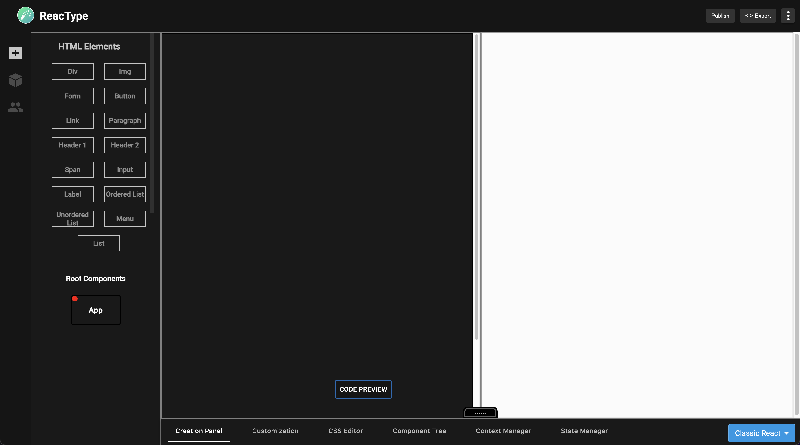

<!-- <p align="center">
  

  <h1 align="center">ReacType </h1>
</p> -->

# ReacType

<!-- PAST LOGOS -->
<!-- <p align="center">
  
</p> -->
<!-- <p align="center">
  
</p> -->
<!-- <p align="center">
  
</p> -->

<div align="left">

[![StarShield][stars]][stars-url]
[![ContributorShield][contributors]][contributors-url]
[![ForksShield][forks]][forks-url]


</div>

 <p align="center">
  
</p> 


<p align="center">
  
</p>

**ReacType** is a rapid prototyping tool that allows users _visualize_ their application architecture dynamically, employing a _drag-and-drop canvas display_ and an interactive, _real-time component code preview_ that can be exported as a **React** app for developers employing React component architecture alongside the comprehensive type-checking of **TypeScript**. In other words, **you can draw prototypes and export React / TypeScript code!**

Visit [reactype.dev](https://reactype.dev) to learn more about the product.

Follow [@ReacType](https://twitter.com/reactype) on Twitter for important announcements.

### Documentation


<!-- NEED TO REPLACE THE TUTORIAL LINK -->

## Changes with Version 18.0.0

- **Collaboration Rooms**: Implemented rooms that allow developers to collaborate together on a project.
  Note: The collaboration room is a beta version and still needs to be improved for larger scaling.
- **User List**: Designed and built a user list that updates in real-time as clients join and exit.
- **Typescript Conversion**: Typescript coverage is now increased to ~90%.
- **Cleanup**: Removed unused code, fixed bugs, and refactored existing code to improve performance, 
- **And more:** See the [change log](https://github.com/open-source-labs/ReacType/blob/master/CHANGE_LOG.md) for more details on what was changed from the previous versions, as well as plans for upcoming features!

## File Structure of ReacType Version 18.0.0

Here is the main file structure:

<p align="center">
  
</p>
Given to us courtesy of our friends over at React Relay  

Please refer to the Excalidraw provided by ReacType Version 14.0 for more details: https://excalidraw.com/#json=JKwzVD5qx6lsfiHW1_pQ9,XJ6uDoehVu-1bsx0SMlC6w 

## Run ReacType using CLI

- **Fork** and **Clone** Repository.
- Open the project directory.
- Install dependencies.

```bash
npm install
```

- To run the production build

```bash
npm run prod
```

- To run tests

```bash
npm run test
```

- To run the development build

```bash
npm run dev
```

- Note that a .env with DEV_PORT, and a NODE_ENV flag (=production or development) are needed.
- Please note that the development build is not connected to the production server. `npm run dev` should spin up the development server from the server folder of this repo. For additional information, the readme is [here](https://github.com/open-source-labs/ReacType/blob/master/server/README.md). Alternatively, you can select "Continue as guest" on the login page of the app, which will not use any features that rely on the server (authentication and saving project data.)

- To run the development build of electron app

```bash
npm run dev
npm run electron-dev
```

## Run Exported App

- Open exported project directory
- Install dependencies

```bash
npm install
```

- Build the app

```bash
npm run build
```


- Start an instance


```bash
npm run start
```

- Open browser and navigate to localhost at specified port

## Stack

Typescript, React.js, Redux Toolkit, Javascript, ESM, Node.js (Express), HTML, CSS, MUI, GraphQL, Next.js, Gatsby.js, Electron, NoSQL, Webpack, TDD (Jest, React Testing Library, Playwright), OAuth 2.0, Websocket, SocketIO, Continuous Integration (Github Actions), Docker, AWS (ECR, Elastic Beanstalk), Ace Editor, Google Charts, React DnD

## Contributions

Here is the up to date [list](https://github.com/open-source-labs/ReacType/blob/master/contributors.md) of all co-developers of this product.
Please visit our [contribution documentation](https://github.com/open-source-labs/ReacType/blob/master/contribution_documentation.md) for more information on how you can contribute to ReacType!

## License

This project is licensed under the MIT License - see the [LICENSE.md](https://github.com/team-reactype/ReacType/blob/development/LICENSE.md) file for details.

[stars]: https://img.shields.io/github/stars/open-source-labs/ReacType
[stars-url]: https://github.com/open-source-labs/ReacType/stargazers
[forks]: https://img.shields.io/github/forks/open-source-labs/ReacType
[forks-url]: https://github.com/open-source-labs/ReacType/network/members
[contributors]: https://img.shields.io/github/contributors/open-source-labs/ReacType
[contributors-url]: https://github.com/open-source-labs/ReacType/graphs/contributors
