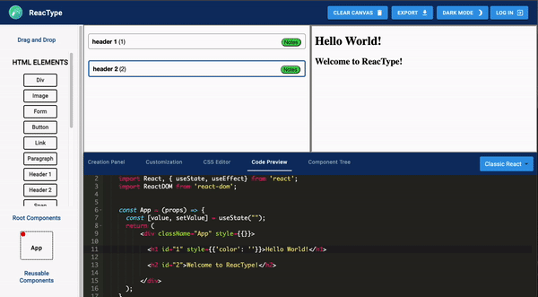

<p align="center">
  
  <h1 align="center">ReacType </h1>
</p>

[](https://github.com/team-reactype/ReacType/pulls)

![Version 11.0.0]

**ReacType** is a rapid prototyping tool for developers employing **React** component architecture alongside the comprehensive type-checking of **TypeScript**.
In other words, **you can draw prototypes and export React / TypeScript code!**

**ReacType** allows users to _visualize_ their application architecture dynamically, employing a _drag-and-drop canvas display_ , a _real-time demo render_ , a _real-time component code preview_. Users can create components and drag _instances_ of these components, as well as HTML elements, onto the canvas. This architecture can then be _exported_ as TypeScript application files to be used as a starter template for any repository.

Download for [MacOS](https://github.com/team-reactype/ReacType/releases), [Windows](https://github.com/team-reactype/ReacType/releases/), [Linux](https://github.com/team-reactype/ReacType/releases/).

- **Mac users**: After opening the dmg and dragging ReacType into your Applications folder, ctrl+click the icon and select 'Open' from the context menu to run the app. This extra step is necessary since we don't have an Apple developer license yet.

- **Windows users**: Install the application by running ReacType Setup 11.0.0.exe.

- **Linux users**: Run the application as a super user in order to read and write files.

<p align='center'>
  
</p>
How to use

- **Sign-in page**: Sign up for an account or just continue as a guest. Registered users enjoy additional project-saving functionality.
- **Tutorial**: Click ‘Tutorial’ from the Help tab’s dropdown menu (at the top left of the application) to view a tutorial.
- **Start a project (only after registration)**: Registered users can create a new project and select whether they want their project to be a Next.js, Gatsby.js, or classic React project. Also, registered users can save projects to return to them at a later time.
- **Add Components**: Create components on the right panel. Components can be associated with a route, or they can be used within other components.
- **Delete Components**: Delete components after focusing on them in the right panel. Be careful when deleting components: Upon deletion, all instances of the component will be removed within the application/project.
- **Add Custom Elements**: Create custom elements or add provided HTML elements into the application. Once the project is exported, the HTML tags generated in the code preview will function as expected. You can specify functionality for custom elements in the code preview. The tutorial on HTML Elements explains more on how to do this.
- **Delete Custom HTML Elements**: Delete custom HTML elements by clicking on the ‘X’ button adjacent to the element. Be careful when deleting custom elements: All instances of the element will be deleted within the application/project.
- **Create Instances on the Canvas**: Each component has its own canvas. Add an element to a component by dragging it onto the canvas. Div components are arbitrarily nestable and useful for complex layouts. Next.js and Gatsby.js projects have Link components to enable client-side navigation to other routes.
- **Component Tree**: Click on the Component Tree tab next to the Code Preview tab to view the component tree hierarchy.
- **Update Styling**: Select an element on the canvas to update its basic style attributes on the right panel. As you create new instances and add styling, watch as your code dynamically generates in the code preview in the bottom panel.
- **Using State in Elements**: As of 10.0.0, you can now select an HTML element on the canvas and then navigate to the customization panel to click a button to pass a variable from state into your element's text or link field.
- **User Preference Features**: With the click of a button, toggle between light mode and dark mode, depending on your preference.
- **Export project**: Click the “Export Project’ button to export the project’s application files into a TypeScript file. The exported project is fully functional with Webpack, Express server, routing, etc., and will match what is mocked on the canvas.
- **Export project with Tests**: Click the "includes tests" checkbox while exporting to include pre-configured Webpack, Jest, and Typescript files along with tests for your project.
- **Export project with Tests**: Sign into ReacType with your GitHub account!
- **Live Render Demo**: Live render demo in React using Electron's sandbox environment. Updates in realtime to reflect canvas structure and customization options.
- **Annotations**: Provide design notes directly on the canvas and have these persist while sharing designs with other engineers.
- **CSS Editor**: Copy and paste custom css styles and classes into the editor and save to use personal or company designs in an instant.
- **State & Props Creator**: Create custom state hooks with real-time updates in the code preview.
- **Application Style Update**: Complete redesign of the entire application for enhanced user experience to maintain a single view application
- **Dashboard**: Click the 'Dashboard' button to view the Public Dashboard and User Dashboard.
- **Like**: Like other people's templates by clicking on the thumbs up icon.
- **Comment**: Comment on other templates by typing in the input field and clicking the comment icon.
- **Download**: Save any public template by clicking the download icon to save a copy as your own.
- **Publish**: Publish any template to the Public Dashboard for other users to download, like, or comment on. Click again to unpublish projects.
- **Sort By**: Click the 'Sort By' button to choose different metrics to sort the Public Dashboard by.
- **Form Nesting**: Nesting within form tags is now fully functional
- **Added Undo and Redo functionality**
- **Test Suite Export**: pre-configured configuration & test file exports with application files.
- **Dark mode**: change the theme of the app for a different asthetic.
- Elements may be added to components in any location, rather than only at the bottom
- Compatibility with Gatsby.js
- Modernized and cleaner UI, including enhanced dark mode
- Tutorial has been updated to reflect other modifications

**New with version 11.0.0:**

- **Enhanced Next.js Functionality**: Create a Next.js application in Reactype! Take advantage of server side rendering and static site generation by using the new improved Next.js link and image components. Simply drag and drop a Link element onto the canvas which can be coupled with a page to support SSR or optimize performance by using Next.js' Image component to enable on-demand image resizing. After you're done, export your project as a Next.js application written in Typescript!
- **More Dark Mode**: Cleaned up the dark mode UI and added it to all areas of the application including the sign in and sign up page.
- **Various Performance Enhancements**: Improved performance by reducing unnecessary re-rendering due to needlessly coupled state hooks
- **And more:** See CHANGE_LOG.md for more details on what was changed from the previous version as well as plans for upcoming features!

### Keyboard Shortcuts

**Mac**:

- Export Project: Command + e
- Undo: Command + z
- Redo: Command + Shift + z
- Save Project As: Command + s
- Save Project: Command + shift + s
- Delete HTML Tag on Canvas: Backspace
- Delete Project: Command + Backspace
- Open Project: Command + o

**Windows**:

- Export Project: Control + e
- Undo: Control + z
- Redo: Control + Shift + z
- Save Project As: Control + s
- Save Project: Control + shift + s
- Delete HTML Tag on Canvas: Backspace
- Delete Project: Control + Backspace
- Open Project: Control + o

#### Contributors

[Abeer Faizan](https://www.linkedin.com/in/abeerfaizan/) [@abeer-f](https://github.com/abeer-f)

[Alex Yu](https://www.linkedin.com/in/alexjihunyu/) [@buddhajjigae](https://github.com/buddhajjigae)

[Aaron Bumanglag](https://www.linkedin.com/in/akbuma) [@akbuma](https://github.com/akbuma)

[Adam Singer](https://linkedin.com/in/adsing) [@spincycle01](https://github.com/spincycle01)

[Alex Wolinsky](https://www.linkedin.com/in/alex-wolinsky-80ab591b2/) [@aw2934](https://github.com/aw2934/)

[Andrew Cho](https://www.linkedin.com/in/andrewjcho84/) [@andrewjcho84](https://github.com/andrewjcho84)

[Anthony Torrero](https://www.linkedin.com/in/anthony-torrero-4b8798159/) [@Anthonytorrero](https://github.com/Anthonytorrero)

[Brian Han](https://www.linkedin.com/in/brianjisoohan/) [@brianjshan](https://github.com/brianjshan)

[Bryan Chau](https://www.linkedin.com/in/chaubryan1/) [@bchauu](https://github.com/bchauu)

[Calvin Cao](http://www.linkedin.com/in/calvincao9/) [@calvincao](https://github.com/calvincao)

[Charles Finocchiaro](https://www.linkedin.com/in/charles-finocchiaro-62440040/) [@null267](https://github.com/null267)

[Chelsey Fewer](https://www.linkedin.com/in/chelsey-fewer/) [@chelseyeslehc](https://github.com/chelseyeslehc)

[Chris Tang](https://www.linkedin.com/in/chrisjtang/) [@chrisjtang](https://github.com/chrisjtang)

[Christian Padilla](https://linkedin.com/in/ChristianEdwardPadilla) [@ChristianEdwardPadilla](https://github.com/ChristianEdwardPadilla)

[Crystal Lim](https://linkedin.com/in/crystallim) [@crlim](https://github.com/crlim)

[Danial Reilley](https://linkedin.com/in/daniel-reilley) [@dreille](https://github.com/dreille)

[Daryl Foster](https://www.linkedin.com/in/darylfosterma/) [@MadinventorZero](https://github.com/MadinventorZero)

[Diego Vazquez](https://www.linkedin.com/in/diegovazquezny/) [@diegovazquezny](https://github.com/diegovazquezny)

[Edward Park](https://www.linkedin.com/in/edwardparkwork/) [@eddypjr](https://github.com/eddypjr)

[Elena Conn](https://www.linkedin.com/in/elena-conn-366346123/) [@elenaconn](https://github.com/elenaconn)

[Eliot Nguyen](https://linkedin.com/in/ibeeliot) [@ibeeliot](https://github.com/ibeeliot)

[Evan Crews](http://www.linkedin.com/in/<ADD_LINKEDIN_USERNAME>/) [@Evan-Crews](https://github.com/Evan-Crews)

[Fredo Chen](https://www.linkedin.com/in/fredochen/) [@fredosauce](https://github.com/fredosauce)

[Jonathan Calvo Ramirez](https://www.linkedin.com/in/jonathan-calvo/) [@jonocr](https://github.com/jonocr)

[Jesse Zuniga](https://linkedin.com/in/jesse-zuniga) [@jzuniga206](https://github.com/jzuniga206)

[Jin Soo Lim](https://www.linkedin.com/in/jin-soo-lim-3a567b1b3/) [@jinsoolim](https://github.com/jinsoolim)

[Julie Wu](https://www.linkedin.com/in/jwuarchitect/) [@yutingwu4](https://github.com/yutingwu4)

[Kevin Park](https://www.linkedin.com/in/xkevinpark/) [@xkevinpark](https://github.com/xkevinpark)

[Khuong Nguyen](https://www.linkedin.com/in/khuong-nguyen/) [@khuongdn16](https://github.com/khuongdn16)

[Katrina Henderson](https://www.linkedin.com/in/katrinahenderson/) [@kchender](https://github.com/kchender)

[Linh Tran](https://www.linkedin.com/in/linhtran51/) [@Linhatran](https://github.com/Linhatran)

[Luke Madden](https://www.linkedin.com/in/lukemadden/) [@lukemadden](https://github.com/lukemadden)

[Michael Ng](https://www.linkedin.com/in/<ADD_USERNAME>/) [@MikoGome](https://github.com/MikoGome)

[Miles Wright](https://www.linkedin.com/in/miles-m-wright) [@Miles818](https://github.com/Miles818)

[Mitchel Severe](https://www.linkedin.com/in/misevere/) [@mitchelsevere](https://github.com/mitchelsevere)

[Natalie Vick](https://www.linkedin.com/in/vicknatalie/) [@natattackvick](https://github.com/natattackvick)

[Nel Malikova](https://www.linkedin.com/in/gmalikova/) [@gmal1](https://github.com/gmal1)

[Philip Hua](https://www.linkedin.com/in/philip-minh-hua) [@pmhua](https://github.com/pmhua)

[Ron Fu](https://www.linkedin.com/in/ronfu)[@rfvisuals](https://github.com/rfvisuals)

[Sean Sadykoff](https://www.linkedin.com/in/sean-sadykoff/) [@sean1292](https://github.com/sean1292)

[Shana Hoehn](https://www.linkedin.com/in/shana-hoehn-70297b169/) [@slhoehn](https://github.com/slhoehn)

[Shlomo Porges](https://linkedin.com/shlomoporges) [@shlomoporges](https://github.com/ShlomoPorges)

[Sophia Huttner](https://www.linkedin.com/in/sophia-huttner-68315975/) [@sophjean](https://github.com/sophjean)

[Stephen Kim](https://www.linkedin.com/in/stephenkim612/) [@stephenkim612](https://github.com/stephenkim612)

[Stormi Hashimoto](https://www.linkedin.com/in/stormikph/) [@stormikph](https://github.com/stormikph)

[Tolga Mizrakci](https://linkedin.com/in/tolga-mizrakci) [@tolgamizrakci](https://github.com/tolgamizrakci)

[Tony Ito-Cole](https://linkedin.com/in/tony-ito-cole) [@tonyito](https://github.com/tonyito)

[Tyler Sullberg](https://www.linkedin.com/in/tyler-sullberg) [@tsully](https://github.com/tsully)

[Ulrich Neujahr](https://www.linkedin.com/in/nobrackets/) [@nobrackets](https://github.com/nobrackets)

[William Cheng](https://www.linkedin.com/in/william-cheng-0723/) [@williamcheng12345](https://github.com/WilliamCheng12345)

[William Rittwage](https://www.linkedin.com/in/william-rittwage) [@wbrittwage](https://github.com/wbrittwage)

[William Yoon](https://www.linkedin.com/in/williamdyoon/) [@williamdyoon](https://github.com/williamdyoon)

[Yuanji Huang](https://www.linkedin.com/in/yuanjihuang/) [@kr1spybacon](https://github.com/kr1spybacon)

## To Run Your Own Version

- **Fork** and **Clone** Repository.
- Open project directory
- Install dependencies

```bash
npm install
```

- To run the production build

```bash
npm run prod
```

- To run the development build

```bash
npm run dev
```

- Please note that the development build is not connected to the production server. `npm run dev` should spin up the development server from the server folder of this repo. For additional information, the readme is [here](https://github.com/open-source-labs/ReacType/blob/master/server/README.md). Alternatively, you can select "Continue as guest" on the login page of the app, which will not use any features that rely on the server (authentication and saving project data.)

## To Run Your Exported Next.js or Gatsby.js Project

- Open exported project directory
- Install dependencies

```bash
npm install
```

- Build the app

```bash
npm run build
```

- Start an instance

```bash
npm run start
```

- Open browser and navigate to localhost at specified port

## License

This project is licensed under the MIT License - see the [LICENSE.md](https://github.com/team-reactype/ReacType/blob/development/LICENSE.md) file for details.
