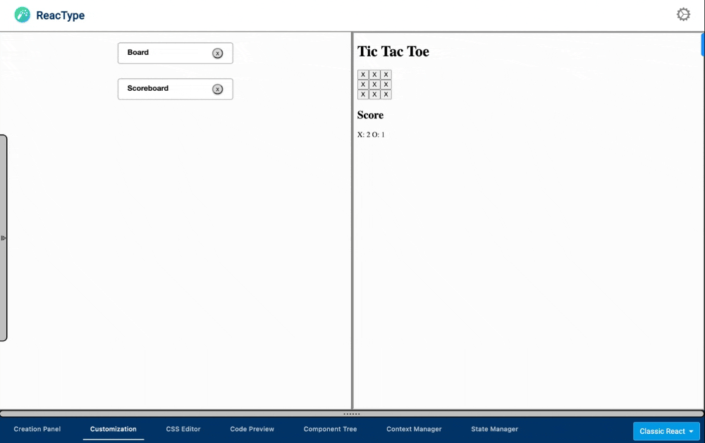

<!-- <p align="center">
  
  <h1 align="center">ReacType </h1>
</p> -->

# ReacType

<!-- <p align="center">
  
</p> -->

<div align="left">

[![StarShield][stars]][stars-url]
[![ContributorShield][contributors]][contributors-url]
[![ForksShield][forks]][forks-url]


</div>
<!-- <p align="center">
  
</p> -->

<p align="center">
  
</p>

<p align="center">
  
</p>

**ReacType** is a rapid prototyping tool that allows users _visualize_ their application architecture dynamically, employing a _drag-and-drop canvas display_ and an interactive, _real-time component code preview_ that can be exported as a **React** app for developers employing React component architecture alongside the comprehensive type-checking of **TypeScript**. In other words, **you can draw prototypes and export React / TypeScript code!**

Visit [reactype.dev](https://reactype.dev) to learn more about the product.

Follow [@ReacType](https://twitter.com/reactype) on Twitter for important announcements.

### Documentation

If you want to read about using ReacType, the [User Manual](https://reactype-1.herokuapp.com/#/tutorial) is free and available online now.

## Changes with version 16.0.0

- **Improved Testing Coverage**: Testing coverage has now doubled since version 15, and now sits at just over 50% coverage. Version 16 introduces end-to-end testing with Playwright and adds additional unit testing with React Testing Library.
- **Major Bug Fixes**: Manage Project Features now work as expected. State Manager now deletes state from parent components. Context Manager Display Tab and CSS Editor now rendering as expected.
- **Typescript Conversion**: Typescript coverage has improved from 30% to 80% with additional interfaces added for quality improvements.
- **Live CSS Demo Rendering**: CSS Editor changes now rendered visually in the demo page on save.
- **Universal Exports on Web App**: Export feature on web app now allows users to download the current project as a zip file with modularized component folder, html, and css file included. Export feature is now available to all users including guests.
- **UI Improvements**: Fixed multiple contrast issues with white text displaying on white background. Adjusted context manager interface for improved UX. Fixed border styling within modals and error messages.
- **And more:** See [change log](https://github.com/open-source-labs/ReacType/blob/master/CHANGE_LOG.md) for more details on what was changed from the previous versions as well as plans for upcoming features!

## File Structure courtesy of Reactype version 14.0.0

Here is the main file structure:

<p align="center">
  
</p>
Please refer to the link: https://excalidraw.com/#json=JKwzVD5qx6lsfiHW1_pQ9,XJ6uDoehVu-1bsx0SMlC6w for more details.

## Run ReacType using CLI

- **Fork** and **Clone** Repository.
- Open project directory
- Install dependencies.

```bash
npm install
```

- To run the production build

```bash
npm run prod
```

- To run tests

```bash
npm run test
```

- To run the development build

```bash
npm run dev
```

- Note that a .env with DEV_PORT, and a NODE_ENV flag (=production or development) are needed.
- Please note that the development build is not connected to the production server. `npm run dev` should spin up the development server from the server folder of this repo. For additional information, the readme is [here](https://github.com/open-source-labs/ReacType/blob/master/server/README.md). Alternatively, you can select "Continue as guest" on the login page of the app, which will not use any features that rely on the server (authentication and saving project data.)

- To run the development build of electron app

```bash
npm run dev
npm run electron-dev
```

## Run Exported App

- Open exported project directory
- Install dependencies

```bash
npm install
```

- Build the app

```bash
npm run build
```

- Start an instance

```bash
npm run start
```

- Open browser and navigate to localhost at specified port

## Stack

Typescript, React.js, Redux, Javascript, D3.js, Node.js (Express), HTML, CSS/SASS, GraphQL, Next.js, Gatsby.js, Electron, SQL, NoSQL, Webpack, TDD (Jest, Enzyme and React Testing Library), OAuth 2.0, Travis CI

## Contributions

Here is the up to date [list](https://github.com/open-source-labs/ReacType/blob/master/contributors.md) of all co-developers of this product.
Please visit our [contribution documentation](https://github.com/open-source-labs/ReacType/blob/master/contribution_documentation.md) for more information on how you can contribute to ReacType!

## License

This project is licensed under the MIT License - see the [LICENSE.md](https://github.com/team-reactype/ReacType/blob/development/LICENSE.md) file for details.

[stars]: https://img.shields.io/github/stars/open-source-labs/ReacType
[stars-url]: https://github.com/open-source-labs/ReacType/stargazers
[forks]: https://img.shields.io/github/forks/open-source-labs/ReacType
[forks-url]: https://github.com/open-source-labs/ReacType/network/members
[contributors]: https://img.shields.io/github/contributors/open-source-labs/ReacType
[contributors-url]: https://github.com/open-source-labs/ReacType/graphs/contributors
