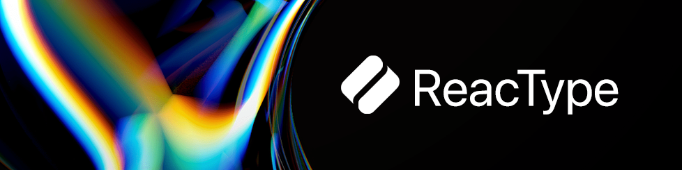
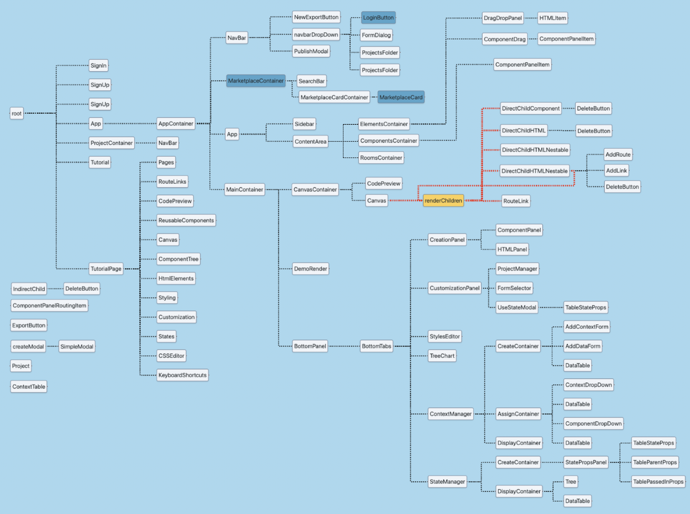

<!-- <p align="center">
  

  <h1 align="center">ReacType </h1>
</p> -->

<!-- PAST LOGOS -->
<!-- <p align="center">
  
</p> -->
<!-- <p align="center">
  
</p> -->
<!-- <p align="center">
  
</p> -->

<div align="left">

[![StarShield][stars]][stars-url]
[![ContributorShield][contributors]][contributors-url]
[![ForksShield][forks]][forks-url]


</div>

 <p align="center">
  
</p>


<h1 align="center">ReacType </h1>

**ReacType** is a React prototyping tool that allows users _visualize_ their application architecture dynamically, employing an interactive drop and drag display with real-time component code preview and a collaboration room that features live video and chat functionality. Generated code can be exported as a **React** app for developers employing React component architecture alongside the comprehensive type-checking of **TypeScript**. In other words, **you can draw prototypes and export React / TypeScript code!**

<p align="center">
  
</p>

Visit [reactype.dev](https://reactype.dev) to learn more about the product.

Follow [@ReacType](https://twitter.com/reactype) on Twitter for important announcements.

## Changes with Version 21.0.0

- **MUI Components**: Material UI can now be used to Create / Style your Applications
- **UI Updates**: The UI now features a more modern and user friendly experience to reflect the newly added Components.
- **DX Updates**: Migrated from Jest to Vitest to allow better compatibility, as well as to reduce complexity and streamline the Development Workflow.
- **JS DOCS**: Added 264 JSDoc comment blocks throughout the codebase.
- **Cleanup**: Removed unused code, fixed bugs, and made major performance improvements.
- **And more:** See the [change log](https://github.com/open-source-labs/ReacType/blob/master/CHANGE_LOG.md) for more details on what was changed from the previous versions, as well as plans for upcoming features!

<p align="center">
  
</p>

## Preview

Get a glimpse of how ReacType works!

<p align="center">
   // update w/ gif previewing MUI components
</p>

<!-- NEED TO REPLACE THE TUTORIAL LINK -->

## File Structure of ReacType Version 21.0.0

Here is the main file structure:

<p align="center">
   // update with updated file structure
</p>

Given to us courtesy of our friends over at React Relay

## Run ReacType using CLI

- **Fork** and **Clone** Repository.
- Open the project directory.
- Install dependencies.

```bash
npm install
```

- To run the production build

```bash
npm run prod
```

- To run tests

```bash
npm run test
```

- To run the development build

```bash
npm run dev
```

- Note that DEV_PORT, NODE_ENV flag (=production or development) and VIDEOSDK token are needed in the .env file.
- Please note that the development build is not connected to the production server. `npm run dev` should spin up the development server from the server folder of this repo. For additional information, the readme is [here](https://github.com/open-source-labs/ReacType/blob/master/server/README.md). Alternatively, you can select "Continue as guest" on the login page of the app, which will not use any features that rely on the server (authentication and saving project data.)
- If there are any errors on spin-up related to MONGO_DB, GITHUB_CLIENT, GITHUB_SECRET, GOOGLE_CLIENT, GOOGLE_SECRET, and SESSION_SECRET, those variables will have to be added to the .env file. To get Google and GitHub credentials, addtional information can be found at the following links: Google [here](https://support.google.com/cloud/answer/6158849?hl=en) and GitHub [here](https://docs.github.com/en/apps/oauth-apps/building-oauth-apps/creating-an-oauth-app).

- To run the development build of electron app

```bash
npm run dev
npm run electron-dev
```

## Run Exported App

- Open exported project directory
- Install dependencies

```bash
npm install
```

- Build the app

```bash
npm run build
```

- Start an instance

```bash
npm run start
```

- Open browser and navigate to localhost at specified port

## Stack

Typescript, React.js, Redux Toolkit, Javascript, ESM, Node.js (Express), HTML, CSS, MUI, GraphQL, Next.js, Gatsby.js, Electron, NoSQL, Webpack, TDD (Vitest, React Testing Library, Playwright), OAuth 2.0, Websocket, SocketIO, Continuous Integration (Github Actions), Docker, AWS (ECR, Elastic Beanstalk), Ace Editor, Google Charts, React DnD, Vite

## Contributions

Here is the up to date [list](https://github.com/open-source-labs/ReacType/blob/master/contributors.md) of all co-developers of this product.

## License

This project is licensed under the MIT License - see the [LICENSE.md](https://github.com/team-reactype/ReacType/blob/development/LICENSE.md) file for details.

[stars]: https://img.shields.io/github/stars/open-source-labs/ReacType
[stars-url]: https://github.com/open-source-labs/ReacType/stargazers
[forks]: https://img.shields.io/github/forks/open-source-labs/ReacType
[forks-url]: https://github.com/open-source-labs/ReacType/network/members
[contributors]: https://img.shields.io/github/contributors/open-source-labs/ReacType
[contributors-url]: https://github.com/open-source-labs/ReacType/graphs/contributors
